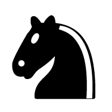

  
  <h1 align="center">ChessAI Prototype</h1>
  

    <a href="https://github.com/UhMarco/ChessAI/">View Main Project</a>
    ·
    <a href="https://uhmarco.github.io/ChessPrototype">Play Prototype</a>
    ·
    <a href="https://github.com/UhMarco/ChessAI/issues">Report Bug</a>
  

This is a prototype for a chess AI I am working on. The purpose of this was to test design choices and get some practice before making a "production" version. The bot makes random moves as no AI will be implemented on this version.

## Known issues:
* After white promoting a pawn, the bot will stop making moves.
* If a black pawn reaches a promotion square then you'll be able to pick what it promotes to.
* King move generation doesn't consider its opponent's king.

## Built with
* [p5.js](https://p5js.org/)
* [GitHub Pages](https://pages.github.com)
* [Pieces from chess.com](https://www.chess.com/)

## Acknowledgements
I took inspiration for this project from these videos:
* [Sebastian Lague's chess AI coding adventure](https://www.youtube.com/watch?v=U4ogK0MIzqk)
* [Code Bullet's chess minimax cideo](https://www.youtube.com/watch?v=DZfv0YgLJ2Q&t=323s)
* [Jack He's multiplayer chess app](https://www.youtube.com/watch?v=QwUZxCBtfLw)
